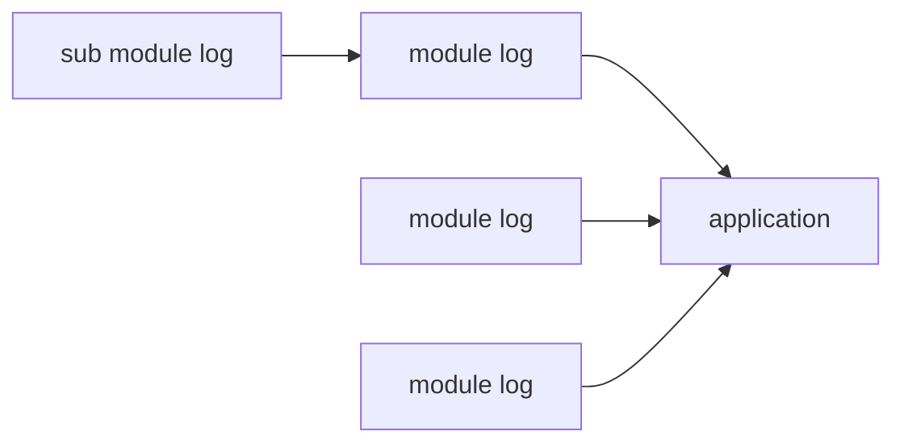

C++ Module日志设计
===

## 背景


在程序中写日志是一件非常重要，但是很容易被开发人员忽视的地方。C++有挺多的日志库（如glog，log4cpp等），方便开发人员写日志。但一般这种log库考虑的是应用写log的方法。而C++作为轮子的制造者，迫切的需求是有一个轻量级的模块日志，方便开发人员在库内写日志。

在库内写日志，一般我们使用printf、std::cout等，又或者嵌入一个log模块。当调用者需要按自己的方式写log时，这些常见的方法显得无能为力。如果存在一个log模块专为C++的导出模块设计，那么它应该具有哪些功能呢？


## 设计方法

### 设计前提



Module内写日志，一般有以下几个问题需要考虑：

+ **不依赖具体log落地实现**：如可以自定义输出到文件、输出到日志采集系统、输出到syslog等；还可定义如需要输出哪些log级别、插入一些traceID等；自定义输出log的格式等。
+ **独立**：各模块间日志插拔式设计，互不影响，可以选择只记录其中某一个或几个模块的log。
+ **轻量**：加入log最好不需要引入太多东西（比如需要编译，导入类等），最好是include导入就可以使用。
+ **简单而易于扩展**：定义好接口之后，不需要修改源码来实现log的多样化；最好是一次发布，基本不用更新。
+ **能够跨语言**：轮子是给各个技术栈使用，跨语言也是一个常见要求。

### 设计原则

+ **只有头文件**：方便直接引入，不需要额外的编译。
+ **接口/功能简单灵活**：定义好后，后续基本不需要改变。
+ **热插拔**：各模块日志独立。

### 实现技巧

+ **定义2个头文件**：一个为回调定义，方便外部接入时，不需要引入mlog的具体实现。
+ **接口**：通过宏方式获取文件、函数等信息；通过RAII构造初始化这些信息，析构调用log回调函数，进行日志上报。
+ **热插拔**：不使用全局变量，而使用模版+静态变量的方法，使得各Module都有自己单独的回调函数，并且避免重复定义的问题。
+ **易用**：使用stream进行日志输出，避免格式化出错。

## 实现

<!--more-->

### Module日志回调的定义

``` cpp
//mlog_def.hpp
#pragma once

/*
** 日志回调函数原型
** @file 日志所在文件
** @line 日志所在代码行
** @func 日志所在函数
** @severity 日志级别
** @context  日志内容
*/
typedef void(*MLogCallBack)(const char *file, int line, const char *func, int severity, const char *content);
```

### Module日志库实现

``` cpp
//mlog.hpp
#pragma once

#include <sstream>
#include <iostream>
#include <functional>
#include <string>
#include "mlog_def.hpp"

/*
** 用于在头文件内生成全局唯一对象
*/
template<typename T>
class GlobalVar {
public:
    static T VAR;
};

template<typename T> T GlobalVar<T>::VAR = nullptr;

/*
** 日志级别
*/
#define MLOG_DEBUG  0
#define MLOG_INFO   1
#define MLOG_WARN   2
#define MLOG_ERROR  3
#define MLOG_FATAL  4

/*
** mlog
*/
namespace mlog
{
    class LogMessage;

    /*
    ** 日志回调设置函数
    */
    static void SetMlogCallBack(MLogCallBack func) { GlobalVar<MLogCallBack>::VAR = func; }
}

/*
** 日志回调生成类
*/
class mlog::LogMessage
{
public:
    LogMessage(const char* file, int line, const char* func, int severity, MLogCallBack callback)
        : _file(file)
        , _line(line)
        , _func(func)
        , _severity(severity)
        , _callback(callback)
    {
    }

    ~LogMessage()
    {
        if (_callback)
        {
            std::string content = _stream.str();
            _callback(_file.c_str(), _line, _func.c_str(), _severity, content.c_str());
        }
    }

    std::ostringstream &stream() { return _stream; }

private:
    std::string _file;
    int _line;
    std::string _func;
    int _severity;

    MLogCallBack _callback;
    std::ostringstream _stream;
};

/*
** 实际使用宏
*/
#define LOG_DEBUG mlog::LogMessage(__FILE__, __LINE__, __FUNCTION__, MLOG_DEBUG, GlobalVar<MLogCallBack>::VAR).stream()
#define LOG_INFO  mlog::LogMessage(__FILE__, __LINE__, __FUNCTION__, MLOG_INFO,  GlobalVar<MLogCallBack>::VAR).stream()
#define LOG_WARN  mlog::LogMessage(__FILE__, __LINE__, __FUNCTION__, MLOG_WARN,  GlobalVar<MLogCallBack>::VAR).stream()
#define LOG_ERROR mlog::LogMessage(__FILE__, __LINE__, __FUNCTION__, MLOG_ERROR, GlobalVar<MLogCallBack>::VAR).stream()
#define LOG_FATAL mlog::LogMessage(__FILE__, __LINE__, __FUNCTION__, MLOG_FATAL, GlobalVar<MLogCallBack>::VAR).stream()
```

## 使用

首先，Module中增加一个导出函数。

``` cpp
//mylibrary.h
#pragma once
 
#ifdef MYLIBRARY_EXPORTS
#define MYLIBRARY_API __declspec(dllexport)
#else
#define MYLIBRARY_API __declspec(dllimport)
#endif
 
#include <mlog/mlog_def.hpp>
MYLIBRARY_API void SetMyLibraryLogCallback(MLogCallBack logCallback);
```

``` cpp
//mylibrary.cpp
#include "mylibrary.h"
#include <mlog/mlog.hpp>
 
MYLIBRARY_API void SetMyLibraryLogCallback(MLogCallBack logCallback)
{
    mlog::SetMlogCallBack(logCallback);
}
```

在使用Module的程序或Module中，调用该函数设置日志回调。

``` cpp
//myapplication.cpp
#include <mlog/mlog_def.hpp>
#include "mylibrary.h"

void LogCallBack(const char *file, int line, const char *func, int severity, const char *content)
{
	//日志处理，可以写，也可以干其他的
}
 
int main(int ,const char*[])
{
    //必要的各种初始化
    SetMyLibraryLogCallback(LogCallBack);

    //...
    return 0;
}
```